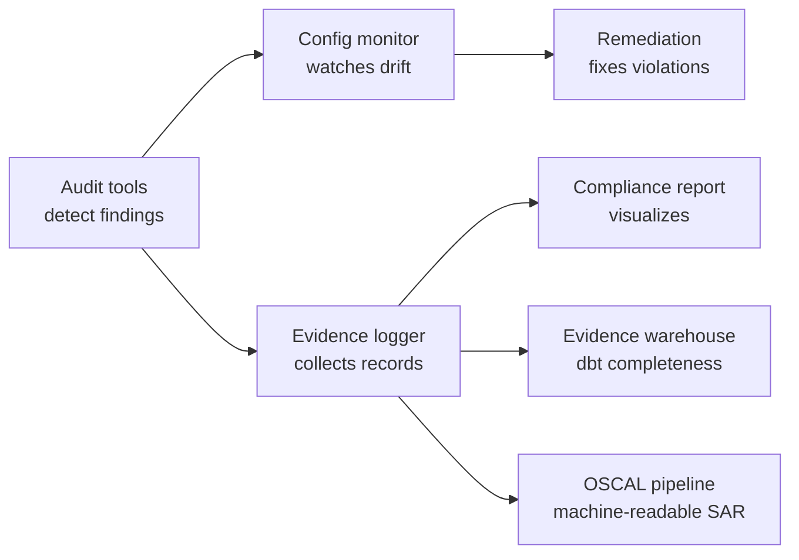

# Hey, I'm Luigi (0xBahalaNa)

## About Me

I was a sworn officer for years, using public safety technology in the field. Then I did Identity Governance at a financial services company: privileged access monitoring, user access reviews, RBAC analysis. Now I do product support at a FedRAMP High public safety software company, and I build the compliance tooling for systems like the ones I used in the field.

I write open-source Python and AWS tools for evidence collection, continuous monitoring, policy-as-code, and compliance-as-code. Mapped to SOC 2, ISO 27001:2022, NIST 800-53 Rev 5, FedRAMP High, and CJIS v6.1. I build with AI agent workflows and MCP integrations: one model writes the code, a separate model audits the diff before anything gets committed.

**Open to:** GRC Engineer | Security Compliance Engineer | Identity Governance Engineer | Compliance Data Engineer

**Frameworks:** SOC 2 | ISO 27001:2022 | NIST 800-53 Rev 5 | FedRAMP High | CJIS Security Policy v6.1 | NIST CSF 2.0

**Certifications:** CGE-P | SSCP | CySA+ | PenTest+ | Security+

## What I'm Building

Open-source work across commercial and federal control sets. The diagram is the federal pipeline: audit tools feeding monitoring and evidence. The commercial work runs on a separate track, where the questionnaire responder answers from the crosswalk's corpus.

## Technical Stack

| Category | Technologies |
| -- | -- |
| **Cloud** | AWS (CloudTrail, Config, EventBridge, GovCloud, IAM, KMS, Lambda, S3, Security Hub) |
| **Languages** | Python (boto3, oscal-pydantic, compliance-trestle), Bash, AWS CLI, SQL |
| **Data / Analytics Engineering** | dbt, DuckDB, SQL (staging → marts, completeness & reconciliation tests), source data contracts |
| **Infrastructure as Code** | AWS CloudFormation, Terraform |
| **Policy-as-Code** | OPA/Rego, Checkov, Conftest |
| **CI/CD** | GitHub Actions |
| **IAM & IGA** | Access Reviews, Privileged Access Monitoring, RBAC, Least Privilege, SSO |
| **Machine-Readable Compliance** | OSCAL (Assessment Results SAR, Component Definitions), IBM Compliance Trestle, oscal-pydantic |
| **Observability** | Kibana/OpenSearch, Splunk, Sentry, SIEM dashboards (KQL) |

## Featured Projects

### Flagships

Seven leads. Three federal, three commercial, and one that sits across both. The commercial three are one arc: own the corpus, answer as the vendor, assess as the customer.

- **[Evidence Warehouse](https://github.com/0xBahalaNa/evidence-warehouse): A failed or delayed authorization blocks federal revenue, and most evidence programs are screenshots in a folder that get re-collected by hand every cycle.** Raw findings land in DuckDB, dbt stages them into a queryable model, and completeness tests fail the build by name when a collector is missing. Lineage from API call to finding. v1.0 shipped 2026-08-12.
- **[OSCAL Evidence Pipeline](https://github.com/0xBahalaNa/oscal-evidence-pipeline): FedRAMP 20x wants machine-readable evidence, and hand-assembled Word SARs are the slowest, most error-prone step of an authorization package.** Audit tool output becomes OSCAL Assessment Results JSON, with IBM Compliance Trestle handling the model work.
- **[AWS Compliance as Code](https://github.com/0xBahalaNa/aws-compliance-as-code): Every misconfiguration an auditor finds after the fact is a remediation cycle you pay for twice.** SCPs deny the non-compliant action at the org, and CloudFormation lays down a baseline that is compliant by default: CloudTrail, IAM, KMS, Config, GuardDuty, Security Hub.
- **[SOC 2 / ISO 27001 / NIST Crosswalk](https://github.com/0xBahalaNa/soc2-iso-27001-nist-800-53-rev-5-crosswalk): Collecting the same evidence three times for three frameworks is the most common waste in a commercial compliance program.** One `mappings.yaml` with SOC 2 Common Criteria as the pivot, NIST 800-53 Rev 5 and ISO 27001:2022 Annex A hung off each criterion with a Strong/Partial/Contextual label. `build_crosswalk.py` emits Markdown, JSON, and CSV; `--check` fails on drift.
- **[Security Questionnaire Responder](https://github.com/0xBahalaNa/security-questionnaire-responder): Security questionnaires sit between a signed deal and revenue, and a confident wrong answer costs more than a slow one.** Drafts grounded answers from the crosswalk corpus with an inline citation and a confidence tier, and returns `INSUFFICIENT_COVERAGE` instead of a plausible guess.
- **[Vendor Security Due Diligence](https://github.com/0xBahalaNa/vendor-security-due-diligence): A vendor breach is your incident, and a review that can't be reproduced at annual re-review is a finding waiting to happen.** `score_vendor.py` scores inherent risk from the data-handling profile and assurance from a weighted CC9.2 / ISO A.5.19-A.5.23 checklist, resolves a residual tier, and writes a decision memo plus JSON you can diff next year.
- **[IAM Access Review](https://github.com/0xBahalaNa/iam-access-review): Access reviews are where SOX ITGC audits fail, and the failure is almost never the wrong person having access. It is that you can't prove the population was complete.** Six identity extracts land in SQLite, reconcile against HR as the population of record, and run through SQL control checks, with a recursive CTE flattening nested groups so privileged reach is the effective answer. Emits an evidence packet with SHA-256 input hashes that regenerates byte-identical. Stdlib only. v1.0 shipped 2026-08-23.

### Frameworks & Gap Analysis

- **[NIST 800-53 Rev 5 to AWS Mapping](https://github.com/0xBahalaNa/nist-800-53-rev-5-to-aws-mapping):** 31 controls mapped to AWS services as an OSCAL Component Definition. Generator filters to FedRAMP High and calls out where CJIS v6.1 pushes past that baseline.
- **[CJIS-FedRAMP Gap Analysis](https://github.com/0xBahalaNa/cjis-fedramp-high-gap-analysis): A public-safety vendor that can't show the CJIS delta from its FedRAMP High baseline loses state and local deals it already qualifies for technically.** Encoded where v6.x is stricter and where CJIS-only controls have no FedRAMP High home. Output is an OSCAL overlay.
- **[CGE-P Capstone](https://github.com/0xBahalaNa/cge-p-capstone):** Graded CGE-P capstone, CMMC Level 2 mapped to NIST 800-171 Rev 3. I inherited an app with eight named gaps and wrapped it in four governance layers without touching the application: a Terraform baseline, an OPA suite that blocks regressions at the pull request, a pipeline that signs and vaults evidence on merge, and an OSCAL component definition an assessor can follow from control claim to signed artifact. Built to the exam spec and independently assessed.

### Infrastructure & Continuous Monitoring

- **[AWS Config Compliance Monitor](https://github.com/0xBahalaNa/aws-config-compliance-monitor):** Config rules fire. Lambda remediates. SSM runs the playbook. Continuous monitoring (CA-7), with FedRAMP 20x KSI tracking in mind.
- **[AWS GRC Terraform Modules](https://github.com/0xBahalaNa/aws-grc-terraform-modules):** Reusable Terraform modules for FedRAMP High and CJIS v6.1 baselines, with OPA/Rego tests and tfsec/checkov CI gates. Companion to the AWS Fundamentals Labs on [luigicarpio.dev/blog](https://luigicarpio.dev/blog).

### Audit & Evidence Collection Tools

- **[IAM Audit](https://github.com/0xBahalaNa/iam-audit):** MFA, access key rotation, credential hygiene.
- **[S3 Audit](https://github.com/0xBahalaNa/s3-audit):** Encryption, public access, versioning.
- **[Security Group Audit](https://github.com/0xBahalaNa/sg-audit):** Overly permissive inbound rules.
- **[CloudTrail Audit](https://github.com/0xBahalaNa/cloudtrail-audit):** Root usage, failed API calls, sensitive IAM / SG / Trail / S3 changes.
- **[Evidence Logger](https://github.com/0xBahalaNa/evidence-logger):** Timestamped evidence files from compliance checks.
- **[Compliance Report](https://github.com/0xBahalaNa/compliance-report):** Pass/fail summaries from aggregated check data.

### Security & Policy-as-Code

- **[Policy Checker](https://github.com/0xBahalaNa/policy-checker):** IAM policy scan for overly permissive configs and CJIS v6.1 violations.
- **[Secret Scanner](https://github.com/0xBahalaNa/secret-scanner):** Usual secrets plus CJI identifiers (ORI, NCIC, FBI numbers, State IDs). Non-zero exit for CI. First adapter into the OSCAL pipeline.

## Currently Learning

- SQL for audit-evidence pipelines: dbt + DuckDB completeness and reconciliation tests in the evidence warehouse
- Terraform modules for compliant AWS resources (S3, EBS encryption baselines)
- OPA / Rego for plan-time policy gates on IaC
- OSCAL authoring (Assessment Results / SAR) for machine-readable evidence

## Where to Find Me

[Portfolio](https://luigicarpio.dev) | [LinkedIn](https://www.linkedin.com/in/luigi-carpio) | [X](https://x.com/0xBahalaNa) | [Medium](https://medium.com/@0xBahalaNa) | [HackTheBox](https://app.hackthebox.com/public/users/1843403)
